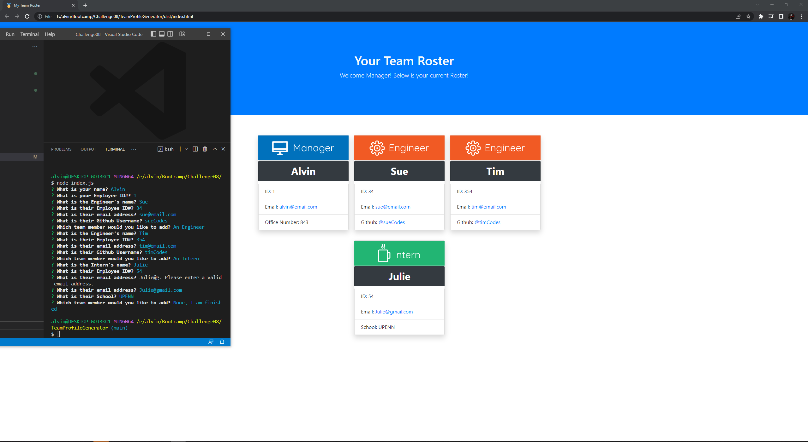
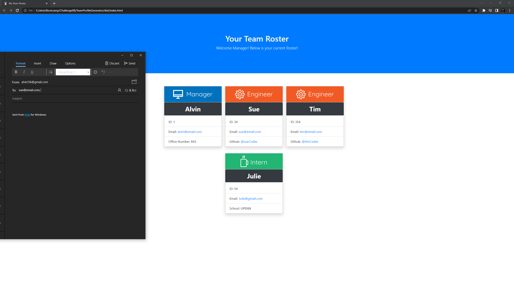

# Team Profile Generator

This was the Eight challenge assignment for our UPENN Bootcamp. We were tasked with creating a CLI that generates a Team Roster Website by answering a series of questions. (See **User Story** and **Acceptable Criteria** sections below).

---

## 📕 User Story 

AS A manager I WANT to generate a webpage that displays my team's basic info SO THAT I have quick access to their emails and GitHub profiles

---

## ✔️ Acceptable Criteria 

- GIVEN a command-line application that accepts user input
- WHEN I am prompted for my team members and their information THEN an HTML file is generated that displays a nicely formatted team roster based on user input
- WHEN I click on an email address in the HTML THEN my default email program opens and populates the TO field of the email with the address
- WHEN I click on the GitHub username THEN that GitHub profile opens in a new tab
- WHEN I start the application THEN I am prompted to enter the team manager’s name, employee ID, email address, and office number
- WHEN I enter the team manager’s name, employee ID, email address, and office number THEN I am presented with a menu with the option to add an engineer or an intern or to finish building my team
- WHEN I select the engineer option THEN I am prompted to enter the engineer’s name, ID, email, and GitHub username, and I am taken back to the menu
- WHEN I select the intern option THEN I am prompted to enter the intern’s name, ID, email, and school, and I am taken back to the menu
- WHEN I decide to finish building my team THEN I exit the application, and the HTML is generated

---

## 🔧 Optimizations 

### Javascript
- Generate an HTML file after user answers a series of questions
- Uses the Inquirer 8.2.4 npm module
- Uses Jest npm module to run tests
- Tests functionality of Employee Parent class and Manager, Intern and Engineer sub-classes
- Links multiple Javascript files together and allows access to functionality
- Validates email address structure
- Opens Github links in a new tab

---

## 📷 Screenshots 

---

## 🎯 Deployment

Repository: https://github.com/alvinkp/TeamProfileGenerator

Walkthrough Video: https://drive.google.com/file/d/1l87W4yQzagW4urRg8o649gaRX-U0Sgbc/view

---

## ✉️ Authors 

- [@alvinkp](https://www.github.com/alvinkp)